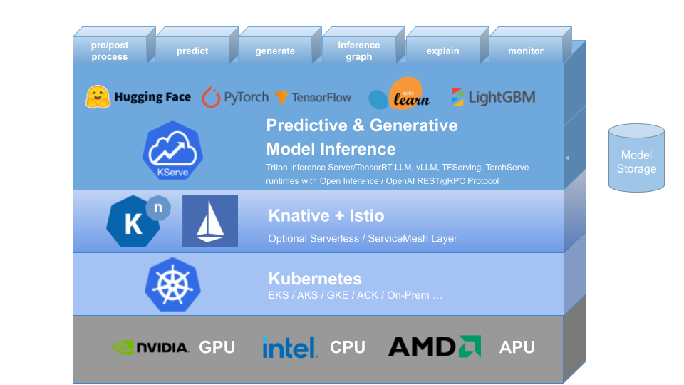

# From Serverless Predictive Inference to Generative Inference: Introducing KServe v0.13

We are excited to unveil KServe v0.13, marking a significant leap forward in evolving cloud native model serving to meet the demands of Generative AI inference. This release is highlighted by three pivotal updates: enhanced Huggingface runtime, robust vLLM backend support for Generative Models, and the integration of OpenAI protocol standards.


Below are a summary of the key changes.

## Enhanced HuggingFace Runtime Support


KServe v0.13 enriches its Hugging Face runtime and now supports running HuggingFace models out-of-the-box. KServe v0.13 implements a [KServe HuggingFace Serving Runtime](https://github.com/kserve/kserve/tree/master/python/huggingfaceserver), `kserve-huggingfaceserver`. With this implementation, KServe can now automatically infer a [task](https://huggingface.co/tasks) from model architecture and select the optimized serving runtime. Currently supported tasks include sequence classification, token classification, fill mask, text generation, and text to text generation.


Here is an example to serve BERT model by deploying an Inference Service with HuggingFace runtime for classification task.

```yaml
apiVersion: serving.kserve.io/v1beta1
kind: InferenceService
metadata:
  name: huggingface-bert
spec:
  predictor:
    model:
      modelFormat:
        name: huggingface
      args:
      - --model_name=bert
      - --model_id=bert-base-uncased
      - --tensor_input_names=input_ids
      resources:
        limits:
          cpu: "1"
          memory: 2Gi
          nvidia.com/gpu: "1"
        requests:
          cpu: 100m
          memory: 2Gi
          nvidia.com/gpu: "1"
```

You can also deploy BERT on the more optimized inference runtime like Triton using Hugging Face Runtime for pre/post processing, see more details [here](https://kserve.github.io/website/master/modelserving/v1beta1/triton/huggingface/).


### vLLM support 

Version 0.13 introduces dedicated runtime support for [vLLM](https://docs.vllm.ai/en/latest/), for enhanced transformer model serving. This support now includes auto-mapping vLLMs as the backend for supported tasks, streamlining the deployment process and optimizing performance. If vLLM does not support a particular task, it will default to the HuggingFace backend. See example below. 

```yaml
apiVersion: serving.kserve.io/v1beta1
kind: InferenceService
metadata:
  name: huggingface-llama2
spec:
  predictor:
    model:
      modelFormat:
        name: huggingface
      args:
      - --model_name=llama2
      - --model_id=meta-llama/Llama-2-7b-chat-hf
      resources:
        limits:
          cpu: "6"
          memory: 24Gi
          nvidia.com/gpu: "1"
        requests:
          cpu: "6"
          memory: 24Gi
          nvidia.com/gpu: "1"
```

See more details in our updated docs to [Deploy the Llama2 model with Hugging Face LLM Serving Runtime](https://kserve.github.io/website/master/modelserving/v1beta1/llm/huggingface/).

Additionally, if the HuggingFace backend is preferred over vLLM, vLLM auto-mapping can be disabled with the `--backend=huggingface` arg.


### OpenAI Schema Integration

Embracing the OpenAI protocol, KServe v0.13 now supports three specific endpoints for generative transformer models:

* `/openai/v1/completions`
* `/openai/v1/chat/completions`
* `/openai/v1/models`

These endpoints are useful for generative transformer models, which take in messages and return a model-generated message output. The [chat completions endpoint](https://platform.openai.com/docs/guides/text-generation/chat-completions-api) is designed for easily handling multi-turn conversations, while still being useful for single-turn tasks. The [completions endpoint](https://platform.openai.com/docs/guides/text-generation/completions-api) is now a legacy endpoint that differs with the chat completions endpoint in that the interface for completions is a freeform text string called a `prompt`. Read more about the [chat completions](https://platform.openai.com/docs/api-reference/chat) and [completions](https://platform.openai.com/docs/api-reference/completions) endpoints int the OpenAI API docs. 

This update fosters a standardized approach to transformer model serving, ensuring compatibility with a broader spectrum of models and tools, and enhances the platform's versatility. The API can be directly used with OpenAI's client libraries or third-party tools, like LangChain or LlamaIndex. 

### Future Plan
* Support other tasks like text embeddings [#3572](https://github.com/kserve/kserve/issues/3572])
* Support more LLM backend options in the future, such as TensorRT-LLM.
* Enrich text generation metrics for Throughput(tokens/sec), TTFT(Time to first token) [#3461](https://github.com/kserve/kserve/issues/3461).
* KEDA integration for token based LLM Autoscaling [#3561](https://github.com/kserve/kserve/issues/3561).


## Other Changes

This release also includes several enhancements and changes:

### What's New?
* Async streaming support for v1 endpoints [#3402](https://github.com/kserve/kserve/issues/3402).
* Support for `.json` and `.ubj` model formats in the XGBoost server image [#3546](https://github.com/kserve/kserve/issues/3546).
* Enhanced flexibility in KServe by allowing the configuration of multiple domains for an inference service [#2747](https://github.com/kserve/kserve/issues/2747).
* Enhanced the manager setup to dynamically adapt based on available CRDs, improving operational flexibility and reliability across different deployment environments [#3470](https://github.com/kserve/kserve/issues/3470).

### What's Changed?
* Removed Seldon Alibi dependency [#3380](https://github.com/kserve/kserve/issues/3380).
* Removal of conversion webhook from manifests. [#3344](https://github.com/kserve/kserve/issues/3344).

For complete details on the new features and updates, visit our [official release notes](https://github.com/kserve/kserve/releases/tag/v0.13.0-rc0).


## Join the community

- Visit our [Website](https://kserve.github.io/website/) or [GitHub](https://github.com/kserve)
- Join the Slack ([#kserve](https://github.com/kserve/community?tab=readme-ov-file#questions-and-issues))
- Attend our community meeting by subscribing to the [KServe calendar](https://wiki.lfaidata.foundation/display/kserve/calendars).
- View our [community github repository](https://github.com/kserve/community) to learn how to make contributions. We are excited to work with you to make KServe better and promote its adoption!

Thanks for all the contributors who have made the commits to 0.13 release!

The KServe Project
